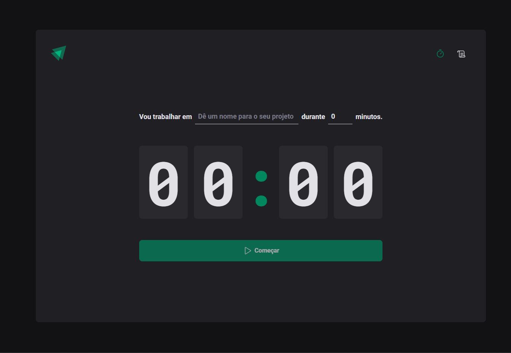
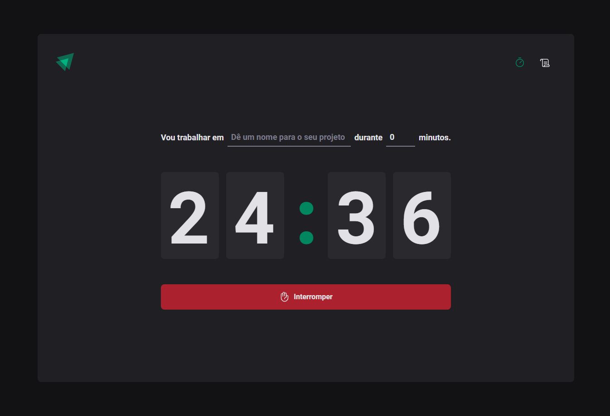
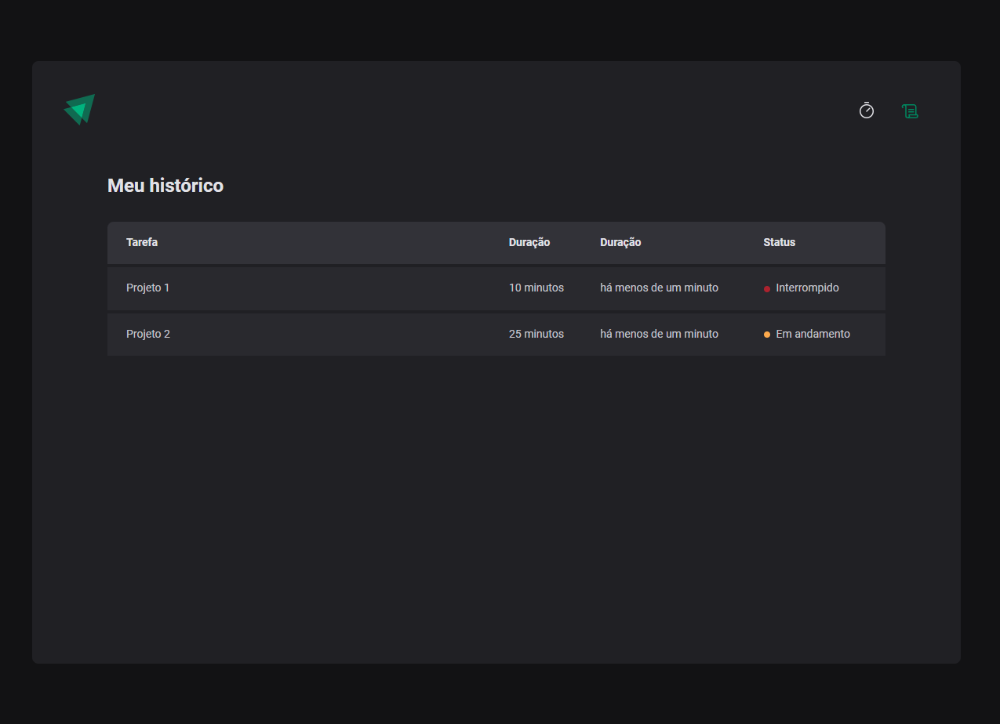

<h1 align="center"> 🏴󠁧󠁢󠁥󠁮󠁧󠁿 Timer </h1>

---




---
## Timer

#### The project developed on the React track on Rocketseat's ignite. It is a timer that allows you to add and time daily tasks with a minimum time of 5 minutes and a maximum of 60 minutes. In addition, you can stop tasks and view the history. It is a useful tool for efficient time management.


```bash
# Access the project folder and download dependencies
$ yarn install
or
$ npm install
```

```bash
# Run Project
$ yarn dev
or
$ npm run dev

```

## ♟️ Techs

- Zod
- React Js
- Date-fns
- Phospor-icons
- React-hook-form
- React-router-dom
- Styled-components


Project: https://timer-67xe.vercel.app/


## 👤 Author

**Carlos Oliveira**

- Website: https://carlossroliveira.github.io/Portfolio/ 🖤
- Github: [@CarlosOliveira](https://github.com/carlossroliveira)
- LinkedIn: [@CarlosOliveira](https://www.linkedin.com/in/carlos-oliveira-ab93941a1/)

---

## 📝 License

Copyright © 2023 [Carlos Oliveira](https://github.com/carlossroliveira).<br />
This project is [MIT](https://opensource.org/licenses/MIT) licensed.

---
